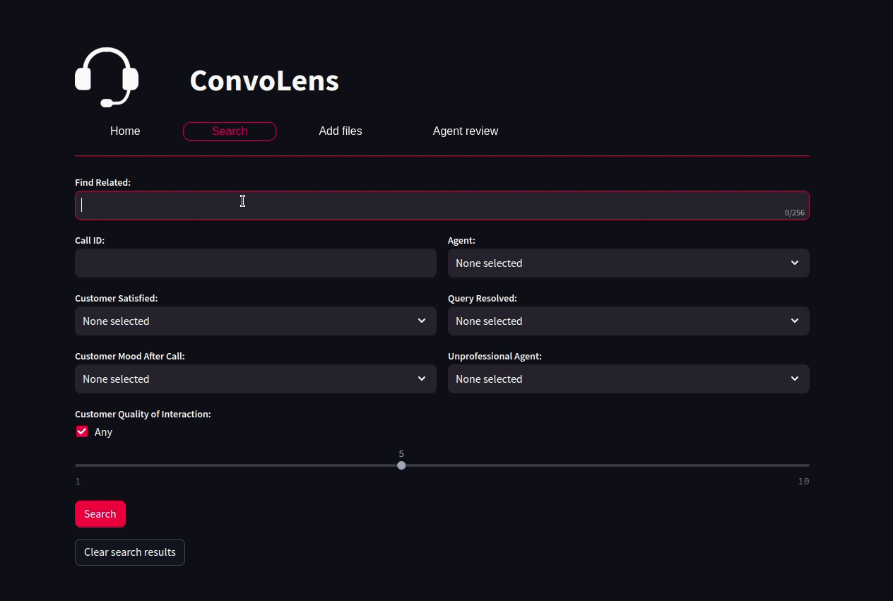
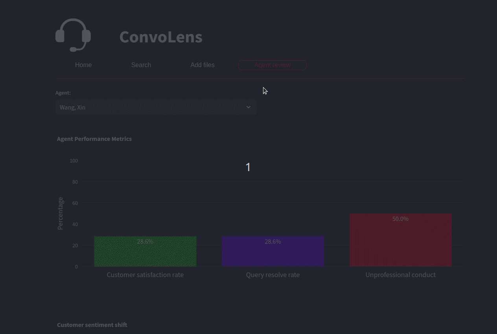

# ConvoLens

### Your Call Center Superpower!
Discover the ultimate tool for call centers, where every conversation becomes a source of power. ConvoLens empowers you to transform your customer interactions, turning data into valuable insights.


### Unleash the Power of Insights

##### Crystal Clear Analysis

Dive deep into customer interactions to find those moments that matter, ensuring satisfaction every time. Unlock the potential of your team by identifying the stars and guiding the underperformers. Track the satisfaction of your customers, ensuring their journey with you is a delightful one.

##### Smart Search
Leverage advanced embeddings and vector cosine similarity search to uncover hidden gems in your audio database. Find relevant conversations with ease, whether it's a topic, sentence, or keyword.

##### Effortless Insights
Easily navigate and explore your data with our intuitive, user-friendly dashboard.

### Stay Ahead with ConvoLens

Experience the future of call center management with ConvoLens. Harness the power of data, gain valuable insights, and elevate your customer service to new heights.

# How it works?

Each audio is processed as following:
1. Audio transcription using OpenAI Whisper.
2. Extraction of features such as customer satisfaction, user quality of interaction, and unprofessional agent behavior.
3. Embedded using OpenAI embeddings
4. Inserted into database (pgvector)

# Demo

### Search



### Agent review




# Run the App

### Setup

```
./setup.sh
```

### Initialize database

```
./db.sh create
```

### Run

```
./run.sh
```
